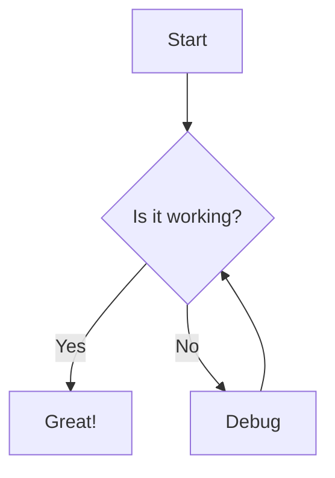
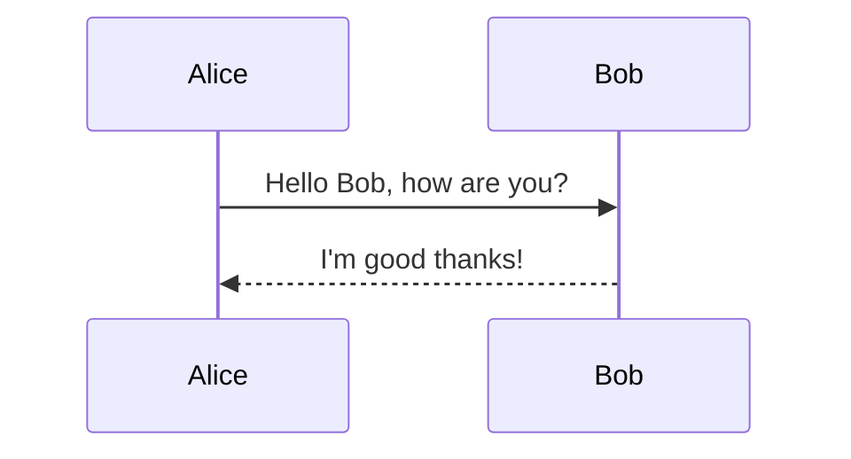
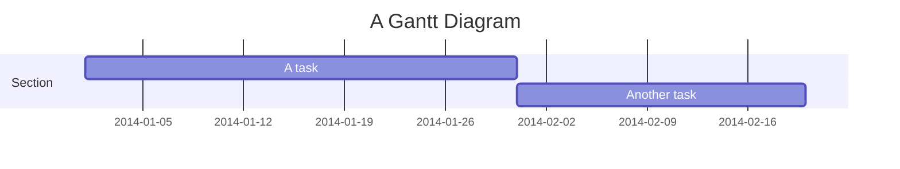
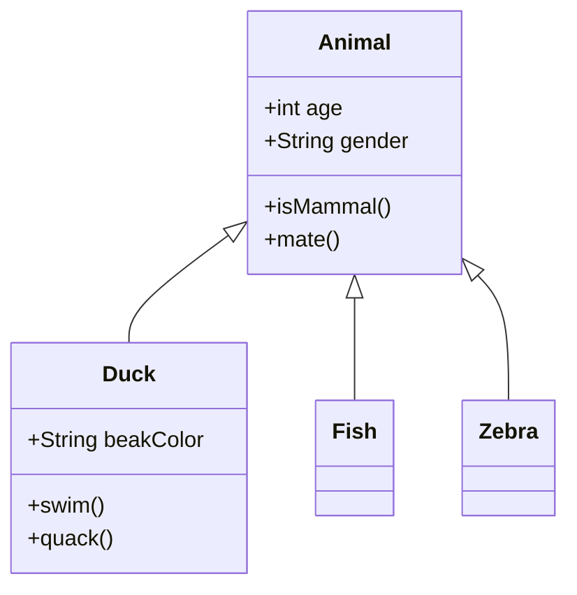
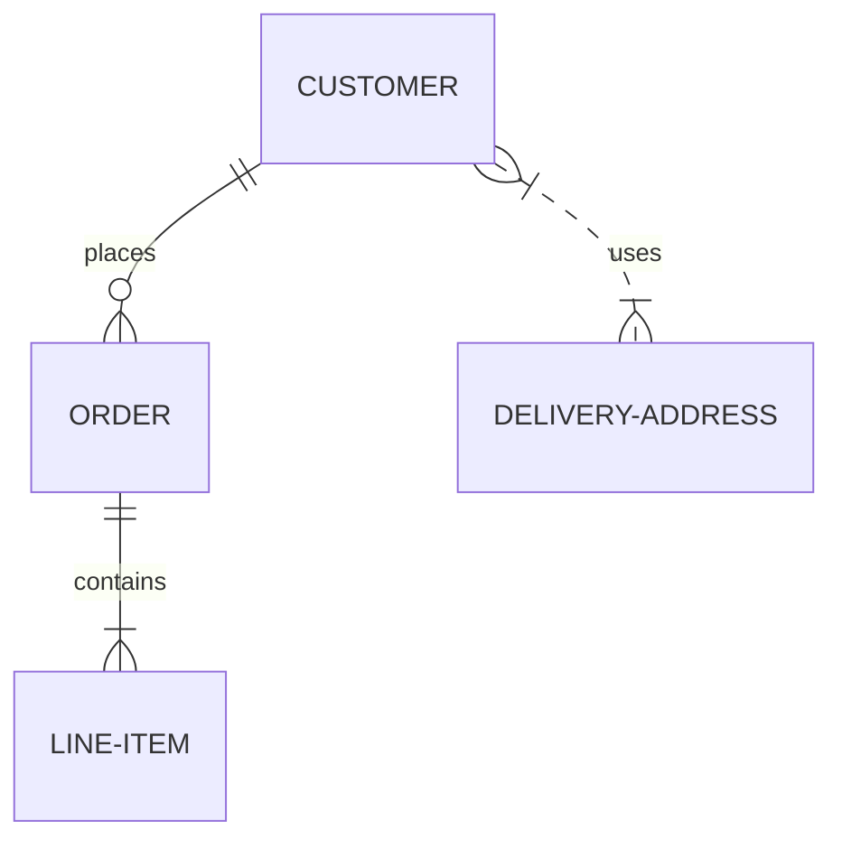
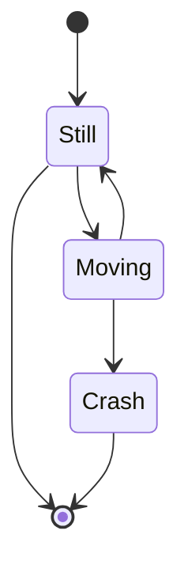
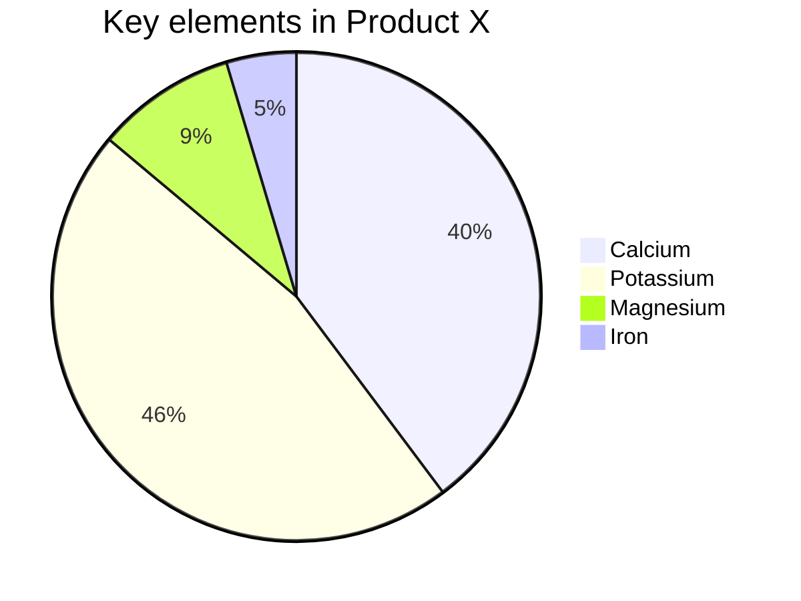
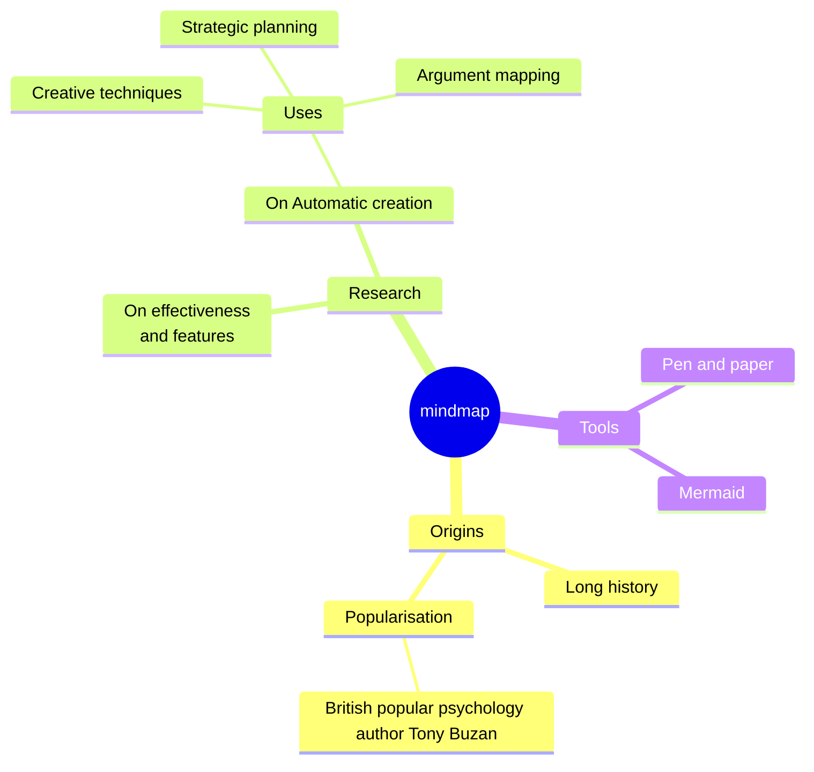

# Architecture Visualizations

This document provides information about the architecture visualizations for the AI-Tools system. These visualizations help developers understand the system structure, component relationships, and data flows.

## Overview

The architecture visualizations are designed to provide a comprehensive view of the AI-Tools system architecture. They include:

- **Module Dependencies**: Shows how different modules depend on each other
- **Feature Timeline**: Visualizes when features were added over time
- **Data Flow**: Illustrates how data moves through the system
- **Module Categories**: Organizes modules by functional category
- **Optimization Pipeline**: Details the prompt optimization process
- **Component Interactions**: Shows the sequence of interactions between components

## Accessing the Visualizations

The visualizations are available in the `docs/architecture` directory:

- [Module Dependencies](./architecture/module-dependencies.md)
- [Feature Timeline](./architecture/feature-timeline.md)
- [Data Flow](./architecture/data-flow.md)
- [Module Categories](./architecture/module-categories.md)
- [Optimization Pipeline](./architecture/optimization-pipeline.md)
- [Component Interactions](./architecture/component-interactions.md)

You can also access them through the [Architecture Dashboard](./architecture/dashboard.html), which provides a web-based interface for exploring the visualizations.

## Color Scheme

The visualizations use a consistent color scheme to represent different types of components:

- **Deep Blue (#1E3A8A)**: Core modules and primary components
- **Teal (#0D9488)**: Performance-related modules
- **Purple (#8B5CF6)**: API and integration modules
- **Orange (#F97316)**: UI and visualization modules
- **Red (#EF4444)**: Security modules
- **Green (#10B981)**: Utility modules
- **Gray (#1F2937)**: Configuration and system modules

## Updating the Visualizations

The architecture visualizations are designed to be updated automatically when the codebase changes. This is accomplished through:

1. **Update Script**: The `docs/architecture/update-diagrams.js` script analyzes the codebase and generates updated diagrams.
2. **GitHub Action**: The `.github/workflows/update-architecture-docs.yml` workflow automatically runs the update script when changes are made to the codebase.
3. **NPM Script**: You can also run the update script manually using `npm run update-architecture`.

### Manual Updates

To update the visualizations manually:

1. Make your changes to the codebase
2. Run `npm run update-architecture`
3. Commit the updated visualizations

### Automated Updates

The GitHub Action will automatically update the visualizations when:

- Changes are pushed to the `main` branch
- Pull requests are created or updated
- The workflow is manually triggered

## Customizing the Visualizations

If you need to customize the visualizations, you can modify the following files:

- **Update Script**: `docs/architecture/update-diagrams.js` contains the logic for generating the diagrams
- **Markdown Files**: The individual `.md` files in the `docs/architecture` directory contain the Mermaid diagrams
- **Dashboard**: `docs/architecture/dashboard.html` contains the web-based interface

### Adding New Visualizations

To add a new visualization:

1. Create a new `.md` file in the `docs/architecture` directory
2. Add the Mermaid diagram to the file
3. Update the `update-diagrams.js` script to include the new visualization
4. Update the dashboard to include a link to the new visualization
5. Update this documentation to reference the new visualization

## Mermaid Syntax

The visualizations use [Mermaid](https://mermaid-js.github.io/mermaid/) syntax for creating diagrams. Here's a quick reference:

### Flowchart

### Sequence Diagram

### Gantt Chart

### Class Diagram

### Entity Relationship Diagram

### State Diagram

### Pie Chart

### Mindmap

## Best Practices

When working with the architecture visualizations, follow these best practices:

1. **Maintain the Color Scheme**: Use the established color scheme for consistency
2. **Keep Diagrams Focused**: Each diagram should focus on a specific aspect of the system
3. **Use Appropriate Diagram Types**: Choose the right diagram type for the information you're trying to convey
4. **Include Context**: Provide explanatory text around diagrams to help readers understand them
5. **Update Regularly**: Keep the visualizations up-to-date with the codebase
6. **Test Rendering**: Ensure diagrams render correctly in both GitHub and the dashboard

## Troubleshooting

If you encounter issues with the architecture visualizations:

### Diagram Not Rendering

- Check the Mermaid syntax for errors
- Ensure the diagram is properly enclosed in triple backticks with `mermaid` language specifier
- Verify that the diagram is not too complex for the renderer

### Update Script Failing

- Check the error message for clues
- Ensure all dependencies are installed
- Verify that the script has access to the necessary files

### GitHub Action Failing

- Check the workflow logs for error messages
- Ensure the workflow has the necessary permissions
- Verify that the repository structure matches what the workflow expects

## Contributing

Contributions to the architecture visualizations are welcome! If you have ideas for new visualizations or improvements to existing ones, please:

1. Fork the repository
2. Create a feature branch
3. Make your changes
4. Run the update script to verify your changes
5. Submit a pull request

## License

The architecture visualizations are licensed under the same MIT license as the rest of the AI-Tools project.
