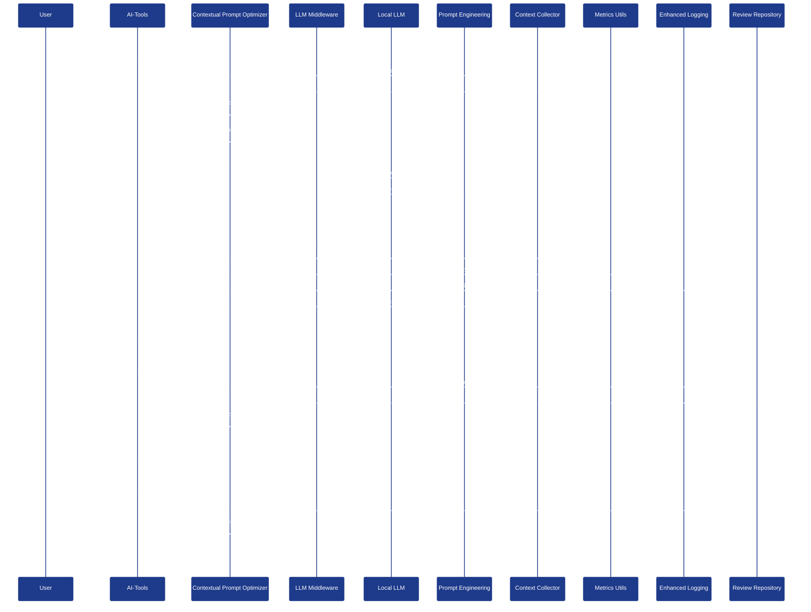
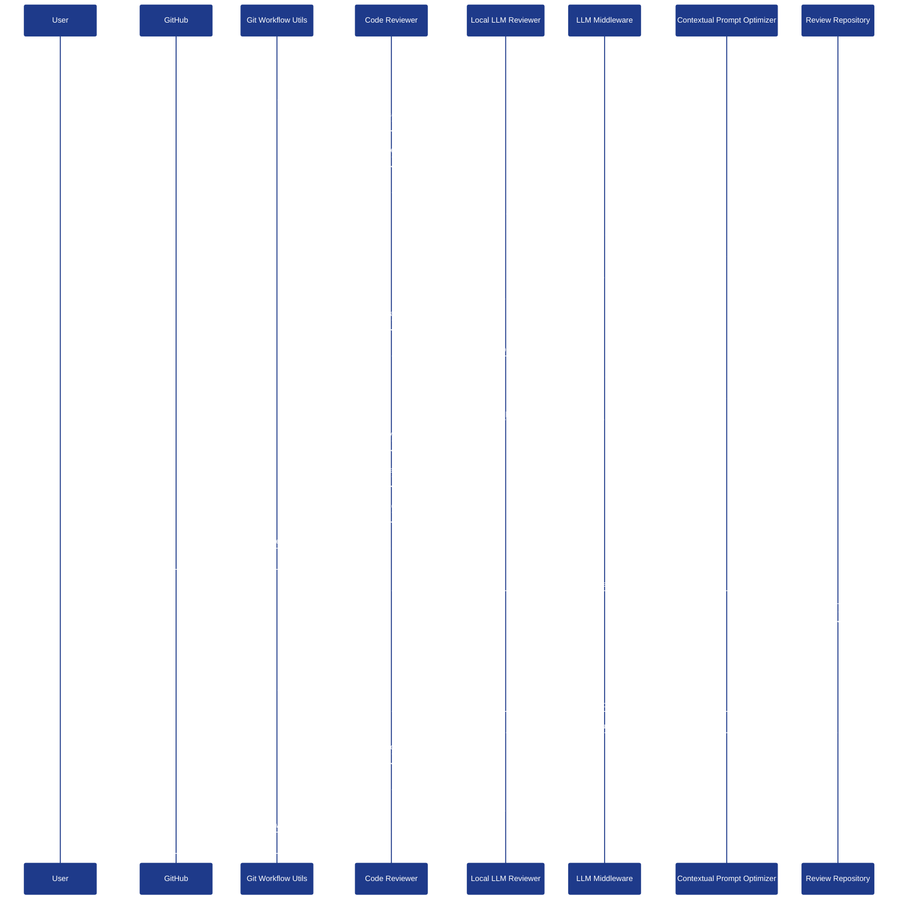
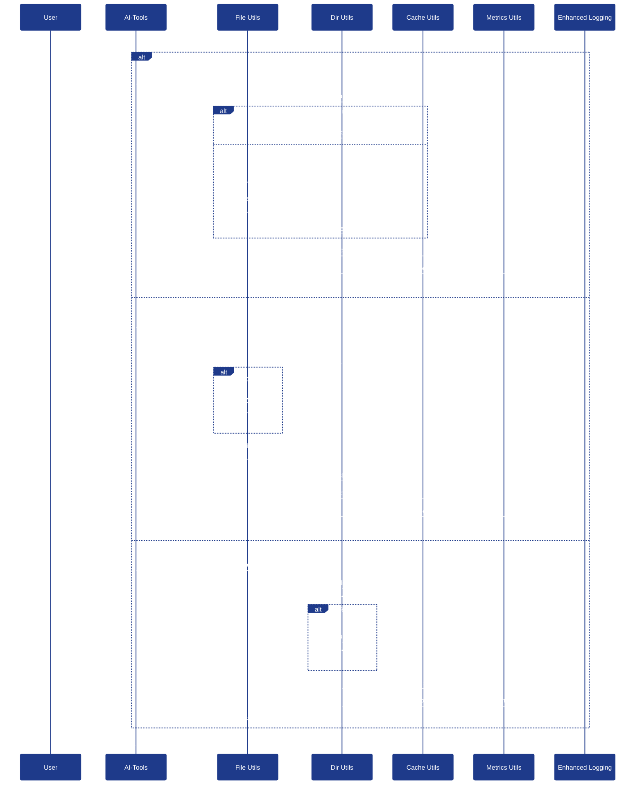
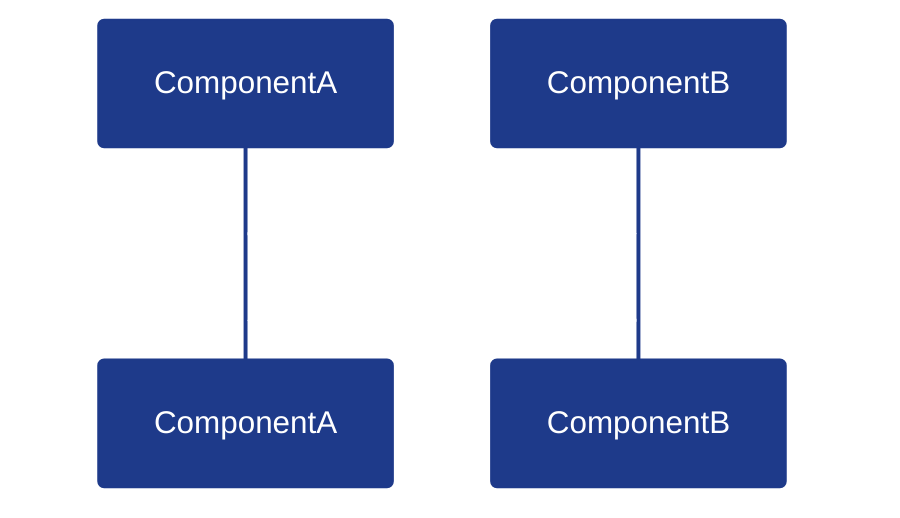
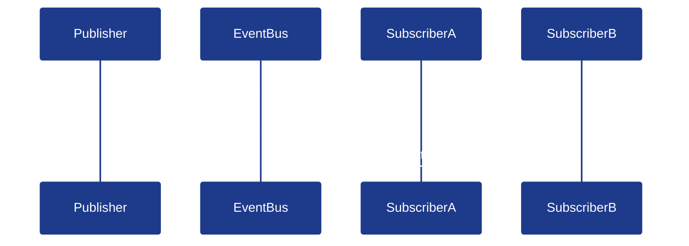
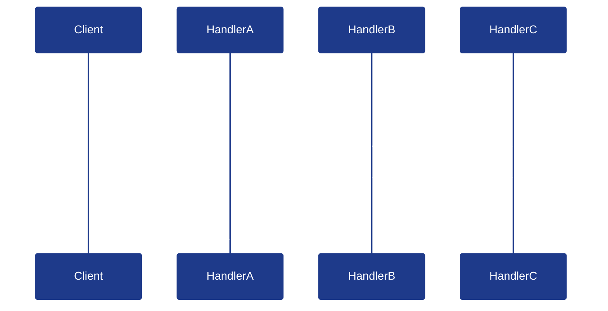
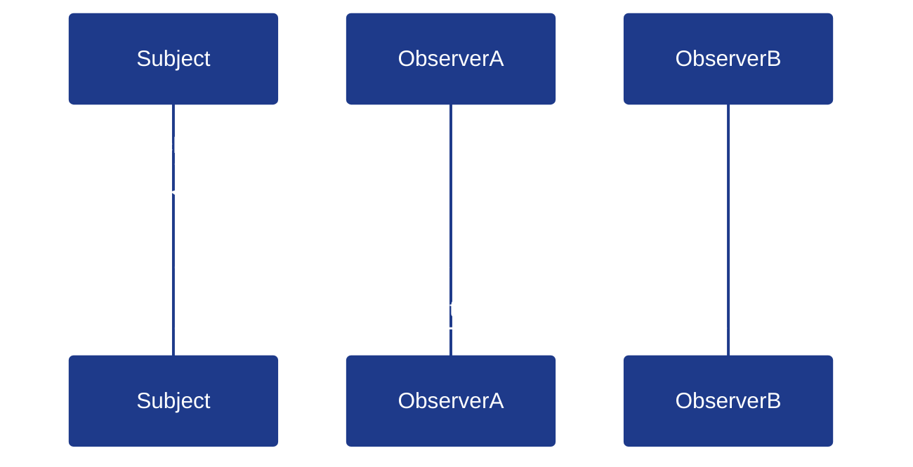
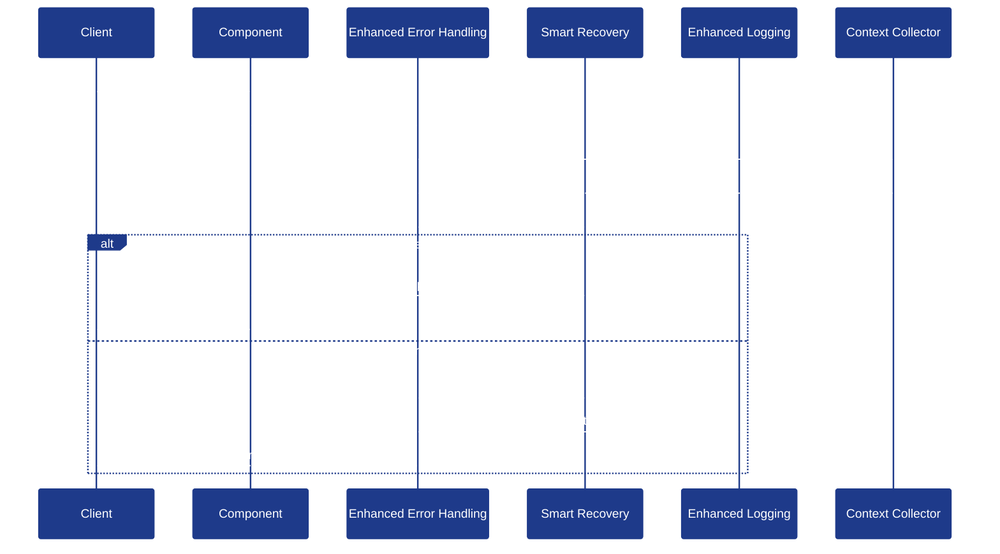

# Component Interactions

This visualization shows the sequence of interactions between different components in the AI-Tools system. Understanding these interactions helps developers comprehend how data and control flow between components during different operations.

## Contextual Prompt Optimization Sequence

The following sequence diagram shows the interactions between components during the contextual prompt optimization process:

## Code Review Sequence

This sequence diagram shows the interactions between components during the code review process:

## File Operations Sequence

This sequence diagram shows the interactions between components during file operations:

## Component Interaction Patterns

The AI-Tools system uses several interaction patterns:

### 1. Request-Response Pattern

The most common interaction pattern is the request-response pattern, where one component sends a request to another and receives a response:

### 2. Publish-Subscribe Pattern

Some components use the publish-subscribe pattern, where one component publishes events and others subscribe to them:

### 3. Chain of Responsibility Pattern

The optimization pipeline uses the chain of responsibility pattern, where a request is passed through a chain of handlers:

### 4. Observer Pattern

The metrics and logging systems use the observer pattern, where components notify observers of state changes:

## Error Handling Interactions

The system includes robust error handling interactions:

## Last Updated

This visualization was last updated on April 2, 2025.
