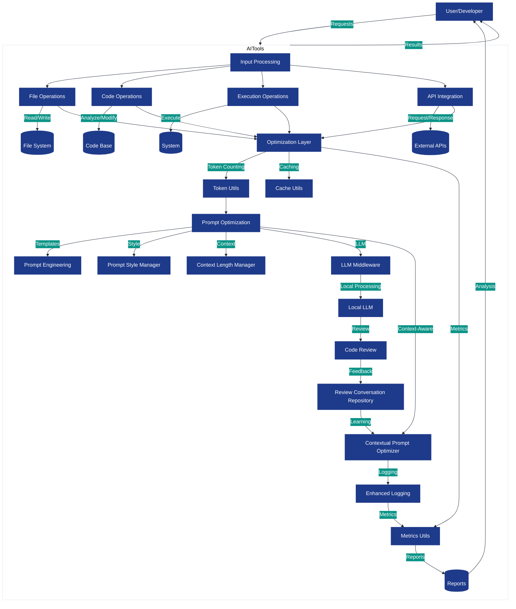
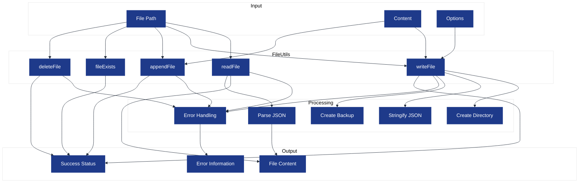
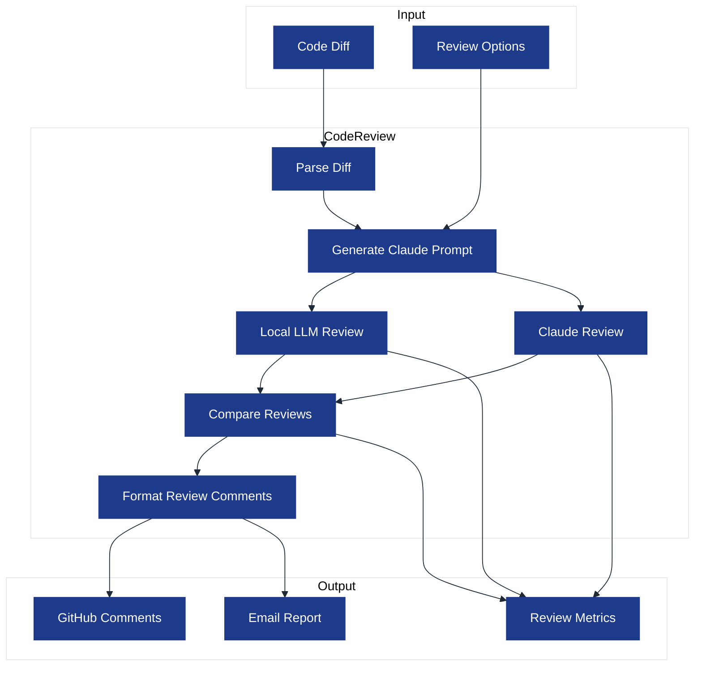

# Data Flow

This visualization illustrates how data flows through the AI-Tools system. Understanding these data flows helps developers comprehend how different components interact and process information.

## System-Level Data Flow

The following diagram shows the high-level data flow through the AI-Tools system:

## Prompt Optimization Data Flow

The following diagram focuses specifically on how data flows through the prompt optimization components:

```mermaid
%%{init: {'theme': 'base', 'themeVariables': { 'primaryColor': '#1E3A8A', 'primaryTextColor': '#fff', 'primaryBorderColor': '#1E3A8A', 'lineColor': '#1F2937', 'secondaryColor': '#0D9488', 'tertiaryColor': '#fff' }}}%%
flowchart LR
    Input[Input Prompt] --> TokenCount[Token Counting]
    TokenCount --> ContextDetect[Context Detection]
    
    ContextDetect --> CodeContext[Code Context]
    ContextDetect --> ConvContext[Conversation Context]
    ContextDetect --> DocContext[Documentation Context]
    
    CodeContext --> ExtractCode[Extract Code Patterns]
    ConvContext --> ExtractConv[Extract Conversation Terms]
    DocContext --> ExtractDoc[Extract Documentation Structure]
    
    ExtractCode --> OptimizeCode[Code-Aware Optimization]
    ExtractConv --> OptimizeConv[Conversation-Aware Optimization]
    ExtractDoc --> OptimizeDoc[Documentation-Aware Optimization]
    
    OptimizeCode --> LocalLLM[Local LLM Processing]
    OptimizeConv --> LocalLLM
    OptimizeDoc --> LocalLLM
    
    LocalLLM --> TokenRecount[Token Recounting]
    TokenRecount --> Metrics[Metrics Collection]
    
    Metrics --> Logging[Enhanced Logging]
    Logging --> Repository[Review Repository]
    
    Repository --> Learning[Learning System]
    Learning --> Feedback[Optimization Feedback Loop]
    
    Feedback --> ContextDetect
    
    TokenRecount --> Output[Optimized Output]
```

## File Operations Data Flow

This diagram shows the data flow for file operations:

## Code Review Data Flow

This diagram illustrates the data flow for the code review process:

## Data Storage

AI-Tools uses several types of data storage:

1. **File System**: For persistent storage of files, configurations, and reports
2. **In-Memory Cache**: For temporary storage of frequently accessed data
3. **Local Database**: For structured storage of metrics, logs, and other data
4. **External APIs**: For integration with external systems

## Data Transformation

As data flows through the system, it undergoes several transformations:

1. **Parsing**: Converting raw data into structured formats
2. **Optimization**: Reducing data size while preserving essential information
3. **Enrichment**: Adding context and metadata to improve usability
4. **Aggregation**: Combining data from multiple sources
5. **Analysis**: Extracting insights and patterns from data

## Data Security

The system includes several security measures to protect data:

1. **Input Validation**: Preventing injection attacks and other security issues
2. **Error Handling**: Preventing sensitive information leakage
3. **Secure Storage**: Protecting sensitive data
4. **Access Control**: Limiting access to authorized users

## Last Updated

This visualization was last updated on April 2, 2025.
