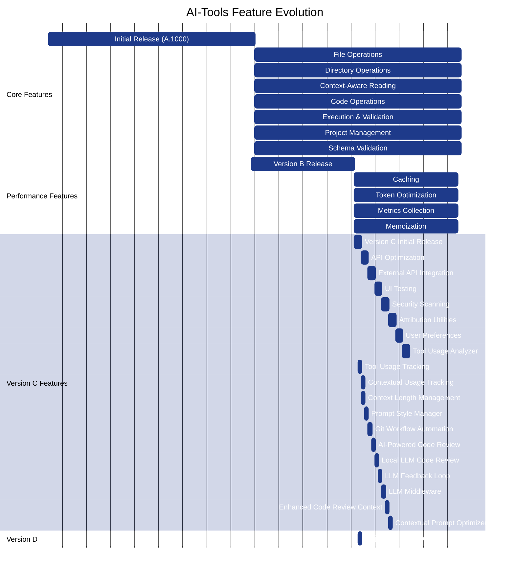

# Feature Timeline

This visualization shows the evolution of AI-Tools features over time. It provides a chronological view of when different components and capabilities were added to the system.

## Feature Evolution Timeline

## Feature Release Details

### Version A (Initial Release - January 2025)

The initial release of AI-Tools focused on core utilities for file operations, code manipulation, and project management:

| Feature | Version | Release Date | Description |
|---------|---------|--------------|-------------|
| File Operations | 25.001.A.1000 | 2025-01-01 | Enhanced file reading/writing with error handling |
| Directory Operations | 25.001.A.1000 | 2025-01-01 | Directory listing, creation, and manipulation |
| Context-Aware Reading | 25.001.A.1000 | 2025-01-01 | Smart file chunk reading and summarization |
| Code Operations | 25.001.A.1000 | 2025-01-01 | Code block finding and manipulation |
| Execution & Validation | 25.001.A.1000 | 2025-01-01 | Command execution and validation |
| Project Management | 25.001.A.1000 | 2025-01-01 | Package.json handling and dependency management |
| Schema Validation | 25.001.A.1000 | 2025-01-01 | Input/output validation with schemas |

### Version B (Performance Release - March 2025)

Version B introduced performance-focused features:

| Feature | Version | Release Date | Description |
|---------|---------|--------------|-------------|
| Caching | 25.060.B.9000 | 2025-03-01 | Multi-level caching system |
| Token Optimization | 25.060.B.9000 | 2025-03-01 | Token counting and optimization for AI models |
| Metrics Collection | 25.060.B.9000 | 2025-03-01 | Performance and usage metrics tracking |
| Memoization | 25.060.B.9000 | 2025-03-01 | Function result caching for expensive operations |

### Version C (Rapid Feature Expansion - March/April 2025)

Version C saw rapid feature expansion with many specialized modules:

| Feature | Version | Release Date | Description |
|---------|---------|--------------|-------------|
| API Optimization | 25.090.C.1000 | 2025-03-31 | Batch requests, throttling, and retries |
| External API Integration | 25.090.C.1000 | 2025-03-31 | Integration with external APIs like Jira |
| UI Testing | 25.090.C.1000 | 2025-03-31 | Color contrast and accessibility testing |
| Security Scanning | 25.090.C.1000 | 2025-03-31 | Code vulnerability scanning |
| Attribution Utilities | 25.090.C.1000 | 2025-03-31 | Code attribution management |
| User Preferences | 25.090.C.1000 | 2025-03-31 | User-specific settings storage |
| Tool Usage Analyzer | 25.090.C.1000 | 2025-03-31 | Analysis of AI-Tools usage opportunities |
| Tool Usage Tracking | 25.091.C.1001 | 2025-04-01 | Function call tracking and metrics |
| Contextual Usage Tracking | 25.091.C.1002 | 2025-04-01 | Context-aware usage tracking |
| Context Length Management | 25.092.C.1003 | 2025-04-02 | Token limit management for AI models |
| Prompt Style Manager | 25.093.C.1004 | 2025-04-02 | Prompt style analysis and optimization |
| Git Workflow Automation | 25.094.C.1005 | 2025-04-02 | Git operations automation |
| AI-Powered Code Review | 25.095.C.1006 | 2025-04-02 | Automated code reviews |
| Local LLM Code Review | 25.096.C.1007 | 2025-04-02 | Code reviews using local LLMs |
| LLM Feedback Loop | 25.097.C.1008 | 2025-04-02 | LLM discussion and improvement system |
| LLM Middleware | 25.098.C.1009 | 2025-04-02 | Prompt optimization with local LLMs |
| Enhanced Code Review Context | 25.099.C.1010 | 2025-04-02 | Code review contextualization |
| Contextual Prompt Optimizer | 25.100.C.1011 | 2025-04-02 | Context-aware prompt optimization |

### Version D (Major Release - April 2025)

Version D is a milestone release that consolidates and enhances all previous features:

| Feature | Version | Release Date | Description |
|---------|---------|--------------|-------------|
| Major Version D Release | 25.091.D.1000 | 2025-04-01 | Consolidated release with improved integration |

## Development Velocity

The timeline shows an interesting pattern in AI-Tools development:

1. **Initial Phase (Version A)**: Focused on core utilities with a steady development pace
2. **Performance Phase (Version B)**: Concentrated on optimization and efficiency
3. **Rapid Expansion (Version C)**: Accelerated development with many specialized features
4. **Consolidation (Version D)**: Integration and refinement of existing capabilities

This pattern reflects the project's maturation from basic utilities to a comprehensive toolkit with specialized AI-focused features.

## Last Updated

This visualization was last updated on April 2, 2025.
