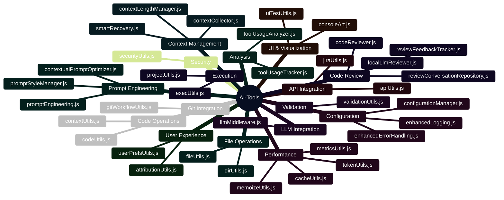

# Module Categories

This visualization organizes AI-Tools modules by functional category. This categorization helps developers understand the purpose of each module and how they relate to different aspects of the system.

## Module Category Map

## Category Descriptions

### File Operations
Modules that handle file system interactions, including reading, writing, and manipulating files and directories.

| Module | Description |
|--------|-------------|
| fileUtils.js | Enhanced file reading/writing with error handling |
| dirUtils.js | Directory listing, creation, and manipulation |

### Code Operations
Modules that analyze and manipulate code, including finding and replacing code blocks, and understanding code context.

| Module | Description |
|--------|-------------|
| codeUtils.js | Code block finding and manipulation |
| contextUtils.js | Context-aware reading and summarization |

### Execution
Modules that handle command execution and project management.

| Module | Description |
|--------|-------------|
| execUtils.js | Command execution with enhanced safety |
| projectUtils.js | Package.json handling and dependency management |

### Validation
Modules that validate input and output data.

| Module | Description |
|--------|-------------|
| validationUtils.js | Input/output validation with schemas |

### Performance
Modules focused on optimizing performance, including caching, token optimization, and metrics collection.

| Module | Description |
|--------|-------------|
| cacheUtils.js | Multi-level caching system |
| tokenUtils.js | Token counting and optimization for AI models |
| metricsUtils.js | Performance and usage metrics tracking |
| memoizeUtils.js | Function result caching for expensive operations |

### API Integration
Modules that integrate with external APIs.

| Module | Description |
|--------|-------------|
| apiUtils.js | API request optimization and management |
| jiraUtils.js | Integration with Jira API |

### UI & Visualization
Modules that handle UI testing and console visualization.

| Module | Description |
|--------|-------------|
| uiTestUtils.js | Color contrast and accessibility testing |
| consoleArt.js | Console-based visualization and formatting |

### Security
Modules focused on security scanning and validation.

| Module | Description |
|--------|-------------|
| securityUtils.js | Code vulnerability scanning and security features |

### User Experience
Modules that enhance the user experience.

| Module | Description |
|--------|-------------|
| userPrefsUtils.js | User-specific settings storage |
| attributionUtils.js | Code attribution management |

### Analysis
Modules that analyze code and tool usage.

| Module | Description |
|--------|-------------|
| toolUsageAnalyzer.js | Analysis of AI-Tools usage opportunities |
| toolUsageTracker.js | Function call tracking and metrics |

### Context Management
Modules that manage context for AI interactions.

| Module | Description |
|--------|-------------|
| contextCollector.js | Detailed context capture for AI interactions |
| smartRecovery.js | Error recovery with retry and fallback patterns |
| contextLengthManager.js | Token limit management for AI models |

### Prompt Engineering
Modules focused on prompt optimization and management.

| Module | Description |
|--------|-------------|
| promptEngineering.js | Prompt template management and optimization |
| promptStyleManager.js | Prompt style analysis and optimization |
| contextualPromptOptimizer.js | Context-aware prompt optimization |

### Git Integration
Modules that integrate with Git and GitHub.

| Module | Description |
|--------|-------------|
| gitWorkflowUtils.js | Git operations automation |

### Code Review
Modules that handle code review functionality.

| Module | Description |
|--------|-------------|
| codeReviewer.js | Automated code reviews |
| localLlmReviewer.js | Code reviews using local LLMs |
| reviewConversationRepository.js | Storage and analysis of code review conversations |
| reviewFeedbackTracker.js | Tracking feedback from code reviews |

### LLM Integration
Modules that integrate with language models.

| Module | Description |
|--------|-------------|
| llmMiddleware.js | Prompt optimization with local LLMs |

### Configuration
Modules that handle configuration, error handling, and logging.

| Module | Description |
|--------|-------------|
| configurationManager.js | Configuration management |
| enhancedErrorHandling.js | Advanced error handling and recovery |
| enhancedLogging.js | Structured logging with context |

## Module Distribution

The distribution of modules across categories shows the system's focus areas:

| Category | Module Count | Percentage |
|----------|--------------|------------|
| Code Review | 4 | 13.3% |
| Performance | 4 | 13.3% |
| Context Management | 3 | 10.0% |
| Prompt Engineering | 3 | 10.0% |
| Configuration | 3 | 10.0% |
| File Operations | 2 | 6.7% |
| Code Operations | 2 | 6.7% |
| Execution | 2 | 6.7% |
| API Integration | 2 | 6.7% |
| UI & Visualization | 2 | 6.7% |
| User Experience | 2 | 6.7% |
| Analysis | 2 | 6.7% |
| Validation | 1 | 3.3% |
| Security | 1 | 3.3% |
| Git Integration | 1 | 3.3% |
| LLM Integration | 1 | 3.3% |

This distribution highlights the system's emphasis on code review, performance optimization, and AI-related functionality (context management and prompt engineering).

## Module Relationships Across Categories

Many modules have relationships that span multiple categories. For example:

- **tokenUtils.js** (Performance) is used by **promptEngineering.js** (Prompt Engineering)
- **contextCollector.js** (Context Management) is used by **enhancedLogging.js** (Configuration)
- **codeReviewer.js** (Code Review) is used by **gitWorkflowUtils.js** (Git Integration)

These cross-category relationships demonstrate the integrated nature of the AI-Tools system.

## Last Updated

This visualization was last updated on April 2, 2025.
