# Module Dependencies

This visualization shows the dependencies between different modules in the AI-Tools system. Understanding these relationships helps developers navigate the codebase and understand how changes in one module might affect others.

## Core Module Dependencies

The following diagram shows the primary dependencies between core modules in the AI-Tools system:

## Key Module Relationships

### Contextual Prompt Optimizer Dependencies

The Contextual Prompt Optimizer is one of the newest modules and has several important dependencies:

```mermaid
%%{init: {'theme': 'base', 'themeVariables': { 'primaryColor': '#1E3A8A', 'primaryTextColor': '#fff', 'primaryBorderColor': '#1E3A8A', 'lineColor': '#1F2937', 'secondaryColor': '#0D9488', 'tertiaryColor': '#fff' }}}%%
graph TD
    classDef core fill:#1E3A8A,stroke:#1E3A8A,color:white
    classDef perf fill:#0D9488,stroke:#0D9488,color:white
    classDef api fill:#8B5CF6,stroke:#8B5CF6,color:white
    classDef ui fill:#F97316,stroke:#F97316,color:white
    classDef security fill:#EF4444,stroke:#EF4444,color:white
    classDef utility fill:#10B981,stroke:#10B981,color:white
    classDef config fill:#1F2937,stroke:#1F2937,color:white
    
    contextualPromptOptimizer[contextualPromptOptimizer.js]:::utility
    llmMiddleware[llmMiddleware.js]:::utility
    promptEngineering[promptEngineering.js]:::utility
    reviewConversationRepository[reviewConversationRepository.js]:::utility
    enhancedLogging[enhancedLogging.js]:::config
    contextCollector[contextCollector.js]:::utility
    tokenUtils[tokenUtils.js]:::perf
    metricsUtils[metricsUtils.js]:::perf
    
    contextualPromptOptimizer --> llmMiddleware
    contextualPromptOptimizer --> promptEngineering
    contextualPromptOptimizer --> reviewConversationRepository
    contextualPromptOptimizer --> enhancedLogging
    contextualPromptOptimizer --> contextCollector
    contextualPromptOptimizer --> tokenUtils
    contextualPromptOptimizer --> metricsUtils
```

### LLM Middleware Dependencies

The LLM Middleware module has these key dependencies:

```mermaid
%%{init: {'theme': 'base', 'themeVariables': { 'primaryColor': '#1E3A8A', 'primaryTextColor': '#fff', 'primaryBorderColor': '#1E3A8A', 'lineColor': '#1F2937', 'secondaryColor': '#0D9488', 'tertiaryColor': '#fff' }}}%%
graph TD
    classDef core fill:#1E3A8A,stroke:#1E3A8A,color:white
    classDef perf fill:#0D9488,stroke:#0D9488,color:white
    classDef api fill:#8B5CF6,stroke:#8B5CF6,color:white
    classDef ui fill:#F97316,stroke:#F97316,color:white
    classDef security fill:#EF4444,stroke:#EF4444,color:white
    classDef utility fill:#10B981,stroke:#10B981,color:white
    classDef config fill:#1F2937,stroke:#1F2937,color:white
    
    llmMiddleware[llmMiddleware.js]:::utility
    localLlmReviewer[localLlmReviewer.js]:::utility
    promptEngineering[promptEngineering.js]:::utility
    contextCollector[contextCollector.js]:::utility
    metricsUtils[metricsUtils.js]:::perf
    enhancedErrorHandling[enhancedErrorHandling.js]:::config
    tokenUtils[tokenUtils.js]:::perf
    
    llmMiddleware --> localLlmReviewer
    llmMiddleware --> promptEngineering
    llmMiddleware --> contextCollector
    llmMiddleware --> metricsUtils
    llmMiddleware --> enhancedErrorHandling
    llmMiddleware --> tokenUtils
```

## Module Dependency Statistics

| Module | Direct Dependencies | Dependents |
|--------|---------------------|------------|
| index.js | 30+ | 0 |
| tokenUtils.js | 2 | 10+ |
| metricsUtils.js | 3 | 8+ |
| contextCollector.js | 2 | 6+ |
| enhancedLogging.js | 1 | 5+ |
| promptEngineering.js | 3 | 5+ |

## Dependency Cycles

The system is designed to minimize dependency cycles, but there are a few intentional circular dependencies:

1. **contextCollector ↔ enhancedLogging**: The context collector uses logging, and the enhanced logging uses context information
2. **tokenUtils ↔ promptEngineering**: Token utilities are used by prompt engineering, which provides optimization hints back to token utilities

These cycles are managed through careful interface design to prevent issues.

## Last Updated

This visualization was last updated on April 2, 2025.
