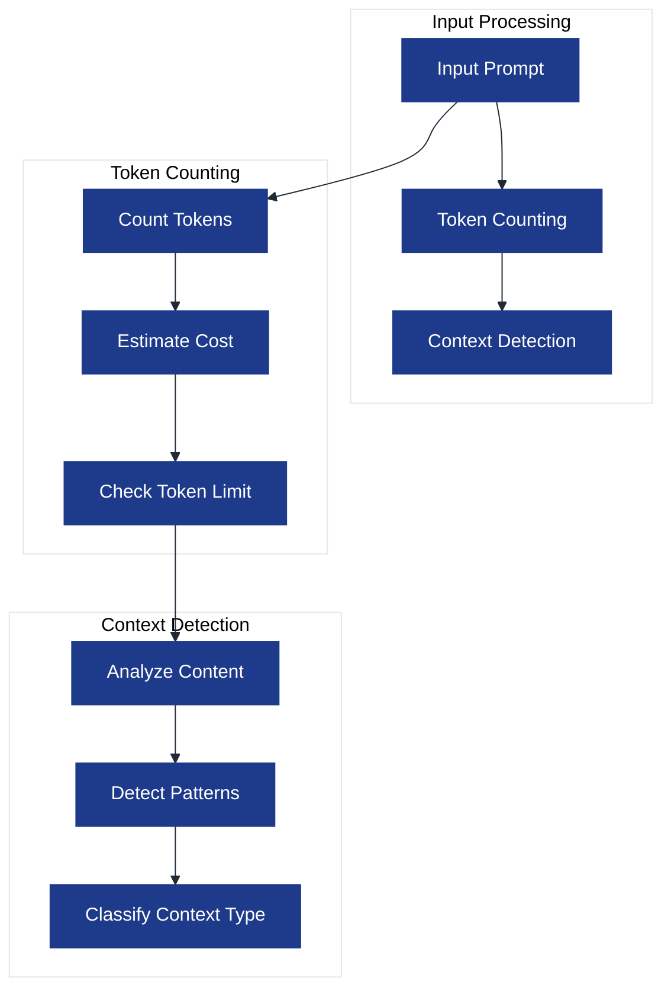
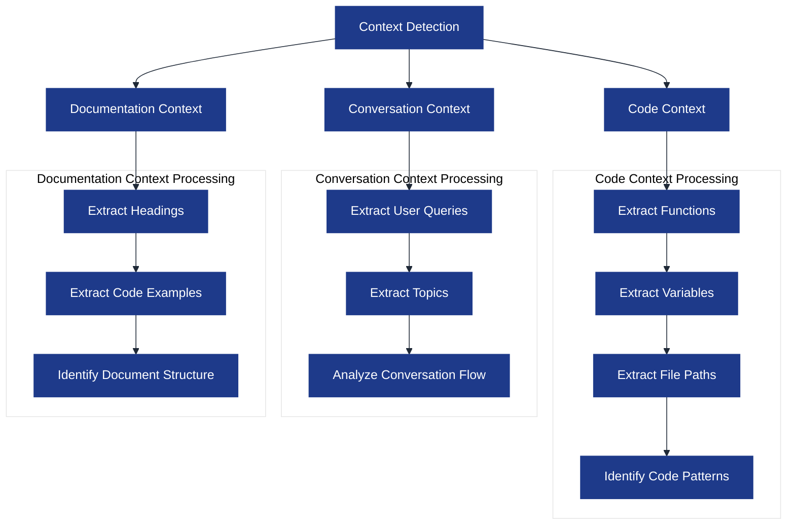
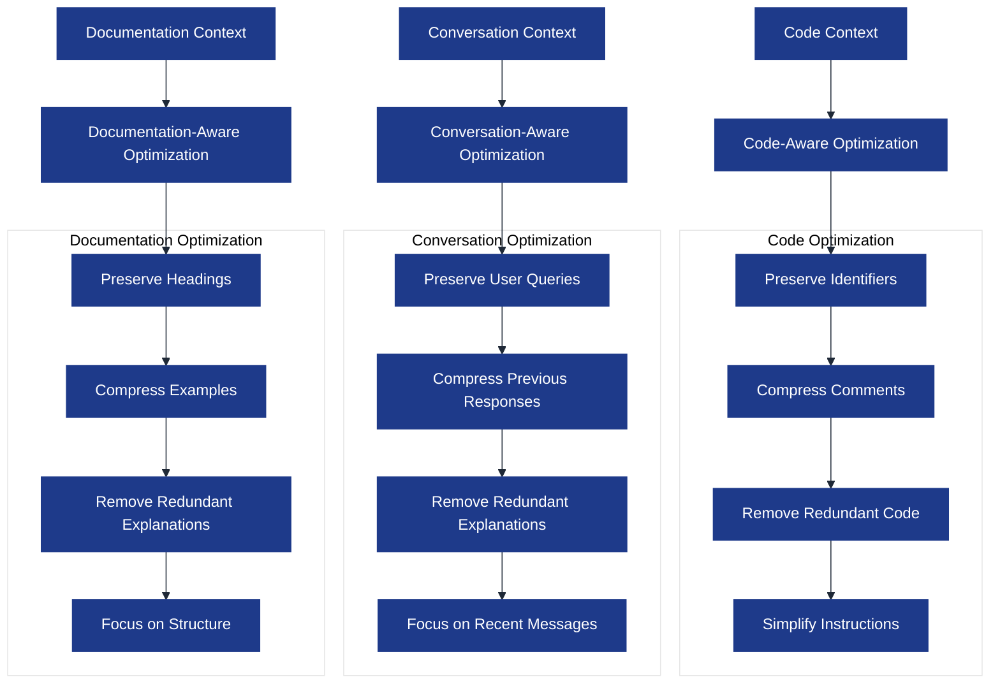
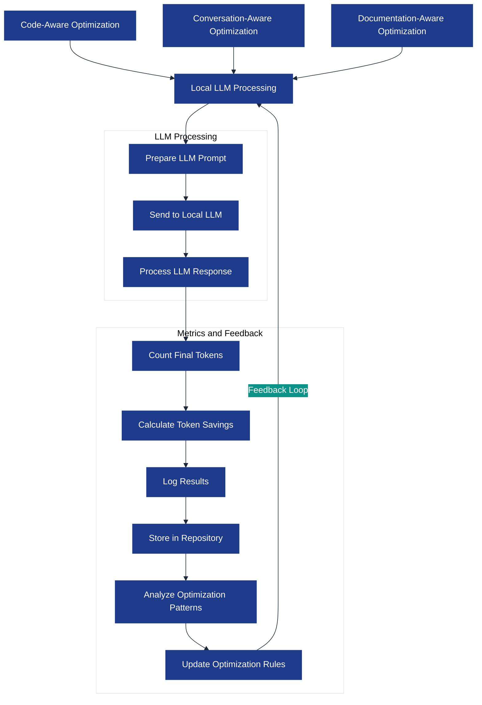

# Optimization Pipeline

This visualization details the prompt optimization pipeline in the AI-Tools system. Understanding this pipeline is crucial for developers working with AI models, as it shows how prompts are processed and optimized for token efficiency.

## Prompt Optimization Pipeline

```mermaid
%%{init: {'theme': 'base', 'themeVariables': { 'primaryColor': '#1E3A8A', 'primaryTextColor': '#fff', 'primaryBorderColor': '#1E3A8A', 'lineColor': '#1F2937', 'secondaryColor': '#0D9488', 'tertiaryColor': '#fff' }}}%%
graph LR
    Input[Input Prompt] --> TokenCount[Token Counting]
    TokenCount --> ContextDetect[Context Detection]
    
    ContextDetect --> CodeContext[Code Context]
    ContextDetect --> ConvContext[Conversation Context]
    ContextDetect --> DocContext[Documentation Context]
    
    CodeContext --> ExtractCode[Extract Code Patterns]
    ConvContext --> ExtractConv[Extract Conversation Terms]
    DocContext --> ExtractDoc[Extract Documentation Structure]
    
    ExtractCode --> OptimizeCode[Code-Aware Optimization]
    ExtractConv --> OptimizeConv[Conversation-Aware Optimization]
    ExtractDoc --> OptimizeDoc[Documentation-Aware Optimization]
    
    OptimizeCode --> LocalLLM[Local LLM Processing]
    OptimizeConv --> LocalLLM
    OptimizeDoc --> LocalLLM
    
    LocalLLM --> TokenRecount[Token Recounting]
    TokenRecount --> Metrics[Metrics Collection]
    
    Metrics --> Logging[Enhanced Logging]
    Logging --> Repository[Review Repository]
    
    Repository --> Learning[Learning System]
    Learning --> Feedback[Optimization Feedback Loop]
    
    Feedback --> ContextDetect
    
    TokenRecount --> Output[Optimized Output]
```

## Pipeline Stages

### 1. Input Processing

The optimization pipeline begins with the input prompt and initial token counting:

### 2. Context-Specific Processing

Based on the detected context type, the pipeline applies specialized processing:

### 3. Optimization Process

Each context type has its own optimization process:

### 4. LLM Processing and Feedback

The optimized prompt is processed by a local LLM, and the results are used to improve future optimizations:

## Optimization Techniques

The optimization pipeline employs several techniques to reduce token usage while preserving essential information:

### General Techniques

1. **Redundancy Elimination**: Removing duplicate or redundant information
2. **Compression**: Shortening text while preserving meaning
3. **Prioritization**: Keeping the most important information
4. **Contextualization**: Using context to infer information rather than stating it explicitly

### Context-Specific Techniques

#### Code Context

| Technique | Description | Token Savings |
|-----------|-------------|---------------|
| Identifier Preservation | Preserve variable and function names | Ensures code functionality |
| Comment Compression | Compress or remove unnecessary comments | 10-30% |
| Redundant Code Removal | Remove boilerplate or repeated code | 20-40% |
| Instruction Simplification | Simplify instructions while preserving intent | 15-25% |

#### Conversation Context

| Technique | Description | Token Savings |
|-----------|-------------|---------------|
| Query Preservation | Preserve user queries | Ensures context |
| Response Compression | Compress previous AI responses | 30-50% |
| Redundant Explanation Removal | Remove repeated explanations | 20-40% |
| Recency Focus | Focus on recent messages | 40-60% |

#### Documentation Context

| Technique | Description | Token Savings |
|-----------|-------------|---------------|
| Heading Preservation | Preserve document structure | Ensures context |
| Example Compression | Compress code examples | 20-30% |
| Redundant Explanation Removal | Remove repeated explanations | 20-40% |
| Structure Focus | Focus on document structure | 30-50% |

## Compression Levels

The optimization pipeline supports three compression levels:

1. **Minimal**: Light optimization that preserves most of the original content
   - Token savings: 10-20%
   - Used for: Critical contexts where information loss is risky

2. **Standard**: Balanced optimization that removes redundancy while preserving key information
   - Token savings: 20-40%
   - Used for: Most contexts

3. **Aggressive**: Heavy optimization that aggressively reduces token count
   - Token savings: 40-60%
   - Used for: Very large prompts or when token efficiency is critical

## Self-Learning System

The optimization pipeline includes a self-learning system that improves over time:

1. **Data Collection**: Optimization results are stored in the Review Conversation Repository
2. **Pattern Analysis**: The system analyzes patterns in successful optimizations
3. **Rule Updates**: Optimization rules are updated based on observed results
4. **Feedback Loop**: Updated rules are applied to future optimizations

This self-learning approach ensures that the optimization pipeline becomes more effective over time.

## Last Updated

This visualization was last updated on April 2, 2025.
